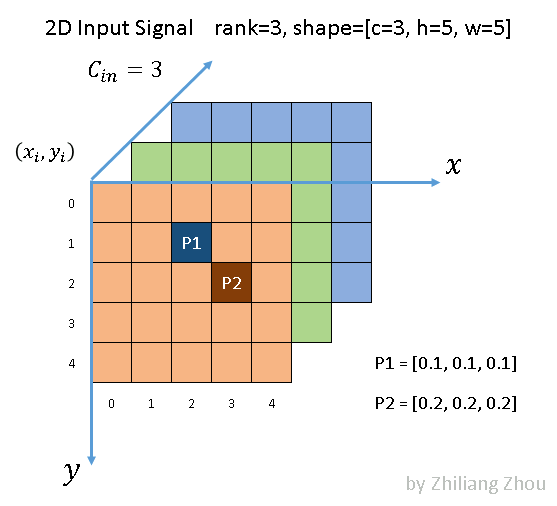
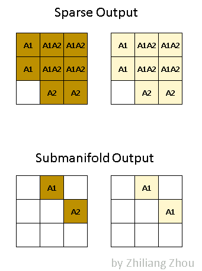
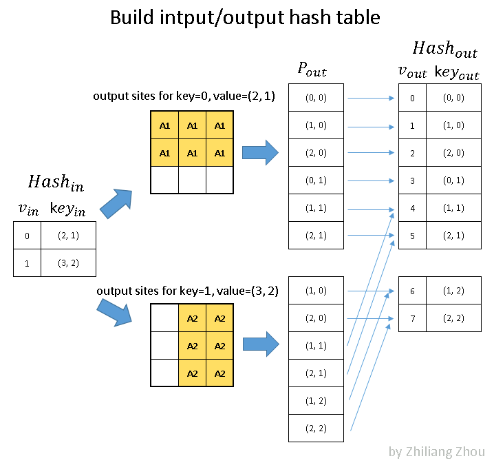
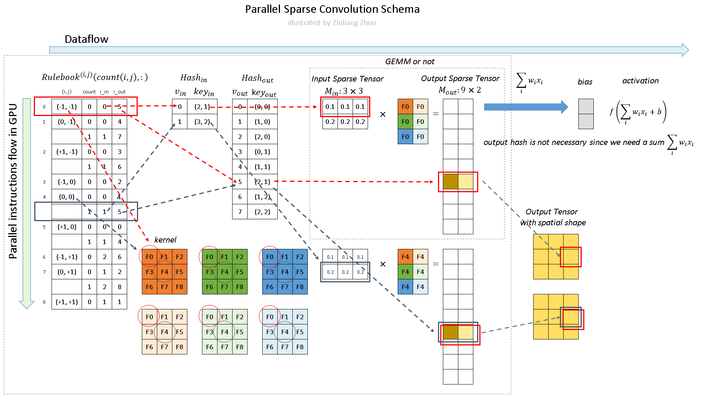

# 1. Introduction
Implementation of sparse convolution is quite different from traditional dense convolution in GPU level.

this project is a lightweight version of [spconv project](https://github.com/traveller59/spconv) by Yan Yan

The work in this repository is mainly involved with following papers:
* [3D Semantic Segmentation with Submanifold Sparse Convolutional Networks](https://arxiv.org/abs/1711.10275)
  * the sparse convolution and active sites concept was firstly in pucblic proposed.
*  [SECOND: Sparsely Embedded Convolutional Detection](https://pdfs.semanticscholar.org/5125/a16039cabc6320c908a4764f32596e018ad3.pdf)
   * a significant performance improvement for sparse convolution was proposed. 
   * the author shared their excellent implementation, which named spconv.
* [Three-dimensional Backbone Network for 3D Object Detection in Traffic Scenes](https://arxiv.org/abs/1901.08373)
    * an excellent review with accurate math notations.


I made following major changes:
* import and modifed a subset of functions from spconv based on my own need. 
* refactor source codes
* fix errors and all compiler warning
* add my understanding about sparse convolution algorithm
* analysing kernel functions and performance
* optimize convolution process
* evaluate with similar functions in the newest pytorch

Github do not support math rendering, this document can be rendered by e.g. MathJax.

this library has been used in my repo [second_lite](https://github.com/masszhou/second_lite)

My results
* KITTI [2011-09-26-0005](https://youtu.be/p5ZlXYoMb5o)
* KITTI [2011 09 26 0023](https://youtu.be/fRAjDE7FdDQ)

# 2. Build
#### dependencies for usage
* python 3.8 
* pytorch 1.6.0 with cuda 10.2
* tqdm (for progressbar in unittest)
* numpy
* cmake 3.15

#### build with cmake
```bash
python setup.py bdist_wheel
```

#### build with docker container

pull the builder container

```bash
docker pull masszhou/toolchains:dev-spconv-lite-1.0
```

to build spconv_lite, under the root path of this project `{spconv_lite_root}/` run

```bash
docker build -t masszhou/spconv_lite:1.0 -f docker/build_spconv_lite.Dockerfile .
```

start a container by

```bash
docker run -d masszhou/spconv_lite:1.0
```

copy pip package to host, then install package in your virtualenv
```bash
docker cp <CONTAINER_ID>:/root/spconv_lite/dist/spconv_lite-1.0.0-cp38-cp38-linux_x86_64.whl .
pip install spconv_lite-1.0.0-cp38-cp38-linux_x86_64.whl
```

shutdown container

```bash
docker stop <CONTAINER_ID>
```

run unittest under `{spconv_lite_root}/unittest`

```bash
python -m test.test_all
```

# 3. My understanding about sparse convolution
### 3.1 input
here we asumme the input siginal is 2D with channel=3, like a image. 2D signal is easier to draw the tensor. There is no essential difference for the convolution between 2D and 3D signals.



consider a image similar signal, which contains only sparse data.
P1, P2 are data points. other cells are zeros.

### 3.2 convolution


notation:
* different color means different input channels
* dark and light colors means different output channels

### 3.3 output and active sites



notation:
* dark and light colors means different output channels
* **A1** means acitve site, convolution result from **P1**
* **A2** means acitve site, convolution result from **P2**
* **A1A2"** means acitve site, the sum of convolution results from **P1**, **P2**

as we can see from the figure. the output is also sparse.
there are two kinds of definitions, which proposed by [3D Semantic Segmentation with Submanifold Sparse Convolutional Networks](https://arxiv.org/abs/1711.10275)
* native sparse output, just like normal convolution, take all the output sites as results, as long as kernel covers input sites.
* submanifold output, the convolution output are only when the kernel center covers the input points.
  
In the program, we can choose either of these definitions, depends on the application.

### 3.4 build hash-table



* to build $Hash_{in}$
  * $V_{in}$ is counter index
  * $key_{in}$ is x,y order position index in image
* to build $Hash_{out}$, see picture.
* key and v are both unique value

### 3.5 build rulebook


* **rulebook** recorded every atomic operation during the convolution with index, with the help from **hash-table**
* **rulebook** is major indexed by **kernel** elements.

### 3.6 Sparse Convolution



* the programm run through instructions flow, i.e. loop the **rulebook**.

# 4. ToDos
* [ ] add more examples
* [ ] add explanation and illustration for cuda kernel
* [ ] compare with SparseConv operations from the most recent pytorch e.g. 1.6+, which is already major updated

# Author

* Zhiliang Zhou, [Linkedin](https://www.linkedin.com/in/zhiliang-zhou/)

# License
The project is derived from [spconv](https://github.com/traveller59/spconv)

The [spconv](https://github.com/traveller59/spconv) code is licensed under Apache-2.0 License
The [CUDPP](https://github.com/cudpp/cudpp) hash code is licensed under BSD License.
The [robin-map](https://github.com/Tessil/robin-map) code is licensed under MIT license.

Besides, if you want directly use any of the figures for algorithm explanation, which were my original works and could be used in my future publications, so please cite this repo for these figures. 

Thanks
